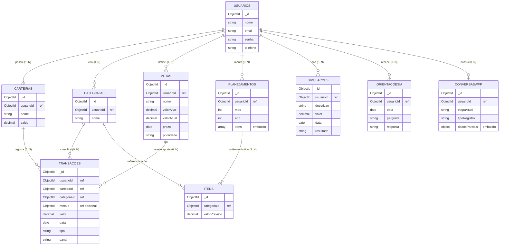

# Modelo de Dados de Objetos — Meu Bolso

> Modelagem orientada a documentos (**MongoDB**). O vocabulário segue o padrão NoSQL: **coleções** (conjunto de documentos), **documentos** (objetos JSON) e relacionamentos por **referência** (guarda-se o `_id` de outro documento) ou **embutido** (o subdocumento é aninhado dentro do documento).

## 1. Minimundo (resumo)

O **Meu Bolso** controla a vida financeira de jovens. Cada **usuário** faz login com e-mail e senha e tem um **telefone** (usado para identificá-lo no WhatsApp). O usuário mantém uma ou mais **carteiras** (ex.: "dinheiro em espécie", "cartão banco X"), cria suas **categorias** e registra **transações** (gasto ou entrada) que alteram o saldo da carteira. Define **metas** (a reserva é apenas uma meta com nome próprio) e pode fazer **aportes** nelas. Monta **planejamentos mensais** com **itens** por categoria. Faz **simulações** (não alteram saldo) e recebe **orientações da IA**. Há ainda **conteúdos de investimento** (iguais para todos) e o estado das **conversas no WhatsApp**. O **resumo financeiro não é armazenado** — é calculado a partir das transações e metas.

## 2. Visão geral das coleções

| Coleção | Finalidade |
|---|---|
| `usuarios` | Conta, login e telefone. Dono de todos os demais dados. |
| `carteiras` | Separações de dinheiro do usuário, com saldo. |
| `categorias` | Categorias criadas pelo usuário para classificar transações. |
| `transacoes` | Gastos e entradas; alteram o saldo da carteira. |
| `metas` | Metas e reserva financeira (reserva = meta comum). |
| `planejamentosMensais` | Planejamento do mês, com itens por categoria (embutidos). |
| `simulacoes` | Histórico de simulações de decisões/compras. |
| `orientacoesIA` | Histórico mínimo de perguntas e respostas do assistente. |
| `conteudosInvestimento` | Conteúdo educativo geral (não pertence a um usuário). |
| `conversasWhatsApp` | Estado de uma conversa em andamento no chatbot. |

> **Não são coleções:** o **Resumo Financeiro** (calculado) e a **Reserva** (é uma `meta`).

---

## 3. Coleções, atributos e tipos

### 3.1 `usuarios`
| Atributo | Tipo | Descrição |
|---|---|---|
| `_id` | ObjectId | Identificador único. |
| `nome` | String | Nome do usuário. |
| `email` | String | E-mail único; usado no login. |
| `senha` | String | Senha com hash (LGPD — nunca em texto puro). |
| `telefone` | String | Cadastrado na web; identifica o usuário no WhatsApp. |

### 3.2 `carteiras`
| Atributo | Tipo | Descrição |
|---|---|---|
| `_id` | ObjectId | Identificador único. |
| `usuarioId` | ObjectId (ref → `usuarios`) | Dono da carteira. |
| `nome` | String | Ex.: "Dinheiro em espécie", "Cartão banco X". |
| `saldo` | Decimal128 | Saldo atual; só muda quando uma transação é registrada. |

### 3.3 `categorias`
| Atributo | Tipo | Descrição |
|---|---|---|
| `_id` | ObjectId | Identificador único. |
| `usuarioId` | ObjectId (ref → `usuarios`) | Dono da categoria. |
| `nome` | String | Ex.: "Alimentação", "Lazer", "Mesada". |

### 3.4 `transacoes`
| Atributo | Tipo | Descrição |
|---|---|---|
| `_id` | ObjectId | Identificador único. |
| `usuarioId` | ObjectId (ref → `usuarios`) | Dono da transação. |
| `carteiraId` | ObjectId (ref → `carteiras`) | Carteira afetada. |
| `categoriaId` | ObjectId (ref → `categorias`) | Categoria da transação. |
| `metaId` | ObjectId (ref → `metas`) \| null | Preenchido quando a transação é um aporte a uma meta. |
| `valor` | Decimal128 | Valor monetário. |
| `data` | Date | Data da transação. |
| `descricao` | String | Descrição livre. |
| `tipo` | String (enum) | `"gasto"` ou `"entrada"`. |
| `canal` | String (enum) | `"web"` ou `"whatsapp"`. |

### 3.5 `metas`
| Atributo | Tipo | Descrição |
|---|---|---|
| `_id` | ObjectId | Identificador único. |
| `usuarioId` | ObjectId (ref → `usuarios`) | Dono da meta. |
| `nome` | String | Ex.: "Viagem", "Reserva de emergência". |
| `valorAlvo` | Decimal128 | Quanto se quer alcançar. |
| `valorAtual` | Decimal128 | Quanto já foi acumulado (progresso = valorAtual / valorAlvo). |
| `prazo` | Date | Data-alvo. |
| `prioridade` | String (enum) | `"alta"`, `"media"` ou `"baixa"`. |

> Os aportes **não** são embutidos: cada aporte é uma `transacao` com `metaId` preenchido (regra do minimundo). Assim o aporte aparece no extrato e no cálculo do saldo.

### 3.6 `planejamentosMensais`
| Atributo | Tipo | Descrição |
|---|---|---|
| `_id` | ObjectId | Identificador único. |
| `usuarioId` | ObjectId (ref → `usuarios`) | Dono do planejamento. |
| `mes` | Int | Mês (1–12). |
| `ano` | Int | Ano (ex.: 2026). |
| `itens` | Array de Objetos (**embutido**) | Lista de `ItemPlanejamento`. |

**`itens` (subdocumento embutido — `ItemPlanejamento`):**
| Atributo | Tipo | Descrição |
|---|---|---|
| `_id` | ObjectId | Identificador do item. |
| `categoriaId` | ObjectId (ref → `categorias`) | Categoria planejada. |
| `valorPrevisto` | Decimal128 | Valor previsto para a categoria no mês. |

### 3.7 `simulacoes`
| Atributo | Tipo | Descrição |
|---|---|---|
| `_id` | ObjectId | Identificador único. |
| `usuarioId` | ObjectId (ref → `usuarios`) | Dono da simulação. |
| `descricao` | String | O que está sendo simulado (ex.: "comprar fone"). |
| `valor` | Decimal128 | Valor da decisão simulada. |
| `data` | Date | Quando foi simulada. |
| `resultado` | String | Impacto calculado no orçamento futuro. |

### 3.8 `orientacoesIA`
| Atributo | Tipo | Descrição |
|---|---|---|
| `_id` | ObjectId | Identificador único. |
| `usuarioId` | ObjectId (ref → `usuarios`) | Dono da orientação. |
| `data` | Date | Data/hora. |
| `pergunta` | String | Pergunta do usuário. |
| `resposta` | String | Resposta educativa da IA. |

### 3.9 `conteudosInvestimento`
| Atributo | Tipo | Descrição |
|---|---|---|
| `_id` | ObjectId | Identificador único. |
| `titulo` | String | Título do conteúdo. |
| `texto` | String | Conteúdo educativo sobre investir. |

> **Não tem `usuarioId`:** é conteúdo geral, igual para todos os usuários.

### 3.10 `conversasWhatsApp`
| Atributo | Tipo | Descrição |
|---|---|---|
| `_id` | ObjectId | Identificador único. |
| `usuarioId` | ObjectId (ref → `usuarios`) | Dono da conversa (identificado pelo telefone). |
| `etapaAtual` | String | Etapa do fluxo (ex.: "carteira", "valor", "categoria", "confirmacao"). |
| `tipoRegistro` | String | O que está sendo registrado (ex.: gasto, aporte). |
| `dadosParciais` | Object (embutido) | Dados coletados até o momento na conversa. |

---

## 4. Relacionamentos, cardinalidades e justificativas

| Relacionamento | Cardinalidade | Estratégia | Justificativa |
|---|---|---|---|
| `usuarios` → `carteiras` | 1 : 1..N | **Referência** | Carteiras são consultadas e têm saldo próprio atualizado por transações; melhor como documentos independentes. |
| `usuarios` → `categorias` | 1 : 0..N | **Referência** | Categorias são reutilizadas por muitas transações e itens de planejamento; separá-las evita duplicação. |
| `carteiras` → `transacoes` | 1 : 0..N | **Referência** (`carteiraId`) | Transações crescem indefinidamente; embuti-las na carteira estouraria o documento. |
| `categorias` → `transacoes` | 1 : 0..N | **Referência** (`categoriaId`) | Mesma categoria classifica inúmeras transações. |
| `usuarios` → `metas` | 1 : 0..N | **Referência** | Metas são filtradas por prioridade/prazo isoladamente. |
| `metas` → aportes | 1 : 0..N | **Referência via `transacoes`** (`metaId`) | O minimundo define que o aporte **é uma transação**; assim ele afeta o saldo da carteira e aparece no extrato. |
| `usuarios` → `planejamentosMensais` | 1 : 0..N | **Referência** | Um planejamento por mês; consultado por mês/ano. |
| `planejamentosMensais` → `itens` | 1 : 1..N | **Embutido** | Itens só existem dentro do planejamento, são poucos e sempre lidos juntos — caso ideal de embutir. |
| `itens` → `categorias` | N : 1 | **Referência** (`categoriaId`) | O item aponta para a categoria existente, sem duplicá-la. |
| `usuarios` → `simulacoes` | 1 : 0..N | **Referência** | Histórico que cresce; consultado isoladamente. |
| `usuarios` → `orientacoesIA` | 1 : 0..N | **Referência** | Histórico ilimitado — não pode ser embutido no usuário. |
| `usuarios` → `conversasWhatsApp` | 1 : 0..N | **Referência** | Estado transitório de conversa; vinculado pelo telefone. |
| (nenhum) → `conteudosInvestimento` | — | **Coleção independente** | Conteúdo global, não pertence a usuário algum. |

### Princípio adotado (embutir vs. referenciar)
- **Embutir** → relação 1:poucos, lida sempre junto, lista limitada: **apenas `itens` dentro de `planejamentosMensais`** (e `dadosParciais` dentro de `conversasWhatsApp`).
- **Referenciar** → tudo que cresce muito ou é consultado isoladamente: transações, metas, carteiras, categorias, simulações, orientações.

### Integridade e consistência com o minimundo
- **Isolamento por usuário:** todo documento (exceto `conteudosInvestimento`) carrega `usuarioId` → cumpre a regra "um usuário nunca acessa dados de outro".
- **Saldo coerente:** o `saldo` da `carteira` só muda via `transacoes` (gasto diminui, entrada aumenta). A aplicação atualiza os dois numa mesma operação.
- **Aporte em meta:** cria uma `transacao` de gasto na carteira **e** soma o valor ao `valorAtual` da `meta` (regra do WhatsApp e da web).
- **Simulações não alteram saldo:** `simulacoes` é uma coleção isolada, sem efeito sobre `carteiras` ou `transacoes`.
- **Reserva:** não há coleção própria — é um documento em `metas` cujo `nome` indica reserva.
- **Resumo financeiro:** calculado em tempo de consulta (soma de entradas, soma de gastos, soma de `valorAtual` das metas); **não é persistido**.
- **Dinheiro:** `Decimal128` em todos os valores monetários, evitando erro de arredondamento de ponto flutuante.
- **Índices sugeridos:** `usuarios { email }` único; `transacoes { usuarioId, data }` e `{ carteiraId }` e `{ metaId }`; `planejamentosMensais { usuarioId, ano, mes }`; `conversasWhatsApp { usuarioId }`.

---

## 5. Diagrama do modelo



> `conteudosInvestimento` não aparece ligado a nada: é uma coleção global, igual para todos os usuários.

## 6. Exemplos de documentos (JSON)

```json
// carteiras
{ "_id": "ObjectId(c1)", "usuarioId": "ObjectId(u1)", "nome": "Dinheiro em espécie", "saldo": { "$numberDecimal": "350.00" } }
```

```json
// transacoes — gasto comum
{ "_id": "ObjectId(t1)", "usuarioId": "ObjectId(u1)", "carteiraId": "ObjectId(c1)",
  "categoriaId": "ObjectId(cat1)", "metaId": null,
  "valor": { "$numberDecimal": "32.50" }, "data": "2026-09-20T12:30:00Z",
  "descricao": "Almoço", "tipo": "gasto", "canal": "web" }
```

```json
// transacoes — aporte a uma meta (gasto na carteira + soma no valorAtual da meta)
{ "_id": "ObjectId(t2)", "usuarioId": "ObjectId(u1)", "carteiraId": "ObjectId(c1)",
  "categoriaId": "ObjectId(cat2)", "metaId": "ObjectId(m1)",
  "valor": { "$numberDecimal": "100.00" }, "data": "2026-09-21T09:00:00Z",
  "descricao": "Aporte reserva", "tipo": "gasto", "canal": "whatsapp" }
```

```json
// planejamentosMensais com itens embutidos
{ "_id": "ObjectId(p1)", "usuarioId": "ObjectId(u1)", "mes": 10, "ano": 2026,
  "itens": [
    { "_id": "ObjectId(i1)", "categoriaId": "ObjectId(cat1)", "valorPrevisto": { "$numberDecimal": "400.00" } },
    { "_id": "ObjectId(i2)", "categoriaId": "ObjectId(cat2)", "valorPrevisto": { "$numberDecimal": "200.00" } }
  ] }
```
